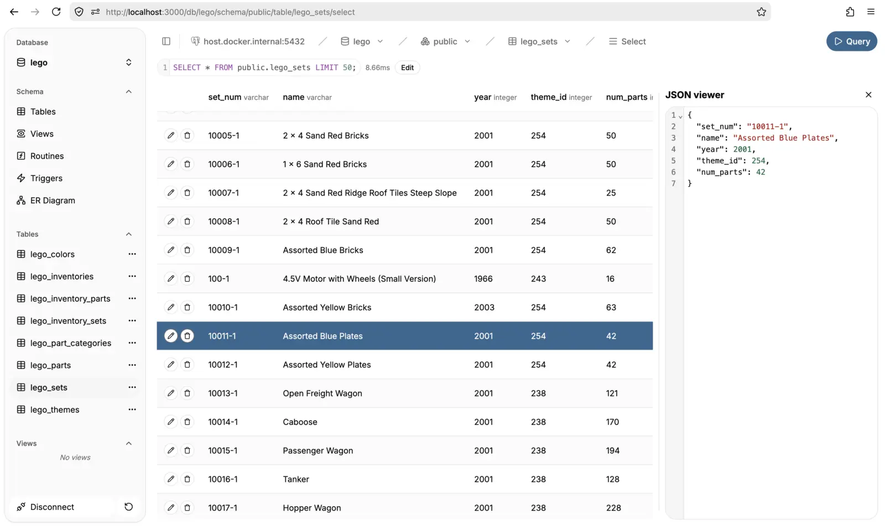

# pgbrowser

A web-based **PostgreSQL client** built for speed and simplicity. It compiles into a **single binary** with zero external dependencies and is packaged as a **docker container**.

## Screenshots



## Features

- Database Navigation: Browse databases, schemas, and tables.
- Schema Exploration: View table structures, columns, indexes, foreign keys, and check constraints.
- Logic Inspection: List and view details for functions and triggers.
- Query Editor: Execute SQL with a CodeMirror 6 editor featuring SQL syntax highlighting and JSON formatting.
- Data Viewer: Browse table records with support for JSON pretty-printing and null value visualization.
- Metrics: View schema and table size metrics.

## Roadmap

See [todos.md](./todos.md) for the full list of planned features, performance improvements, and known issues.

## Prerequisites

- Bun
- Docker (optional)

## Installation and Build

### Using Docker

```bash
docker run -p 3000:3000 ghcr.io/arnovda1/pgbrowser:latest
```

or docker compose

```yaml
name: pgbrowser
services:
  pgbrowser:
    image: ghcr.io/arnovda1/pgbrowser:latest
    restart: unless-stopped
    container_name: pgbrowser
    ports:
      - 3000:3000
```

> Use `host.docker.internal` instead of `localhost` when connecting to a postgres server running on the host machine.

### From Source

```bash
git clone https://github.com/Arnovda1/pgbrowser.git
cd pgbrowser
bun install
bun run build
```

The build process generates the binary at `dist/pgbrowser`.

## Development

Start the development server:

```bash
git clone https://github.com/Arnovda1/pgbrowser.git
cd pgbrowser
bun i
bun dev
```

The client will be available at `http://localhost:5173`.

## License

This project is licensed under the [MIT License](./LICENSE).
